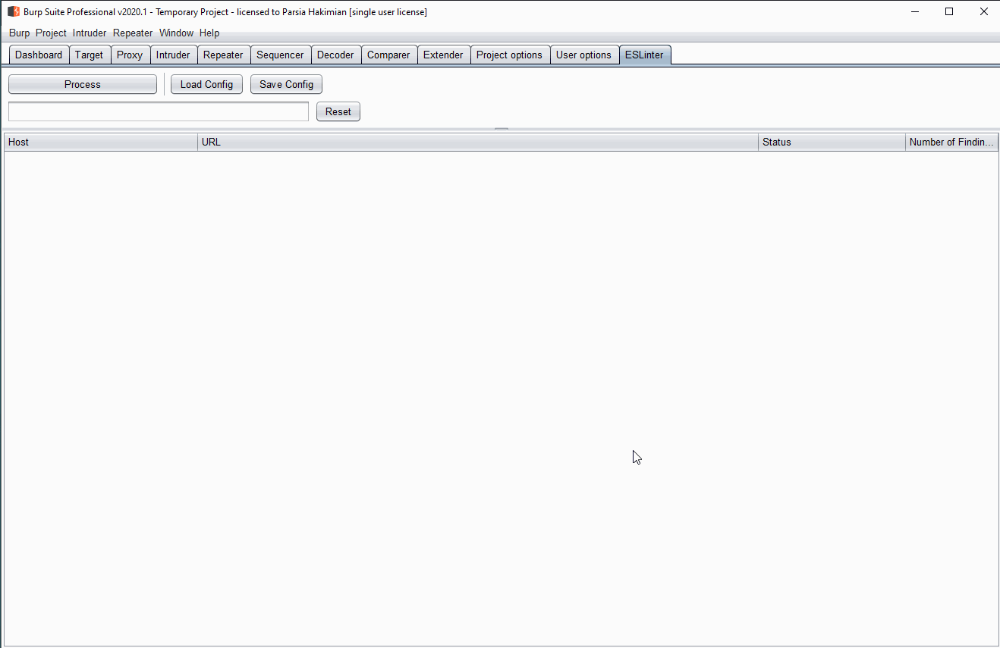

# Manual JavaScript Linting is a Bug  <!-- omit in toc -->
`ESLinter` is a Burp extension that extracts JavaScript from responses and lints
them with [ESLint][eslint-org] while you do your manual testing.

[eslint-org]: https://eslint.org/

## Features

1. Use your own artisanal hand-crafted ESLint rules.
    * Extend Burp's JavaScript analysis engine.
2. Pain-free setup.
    * Get up and running with three commands.
3. Results Are stored in two different places.
    * SQLite is forever.
4. It doesn't interrupt your work flow.
    * Let the extension lint while you do your magic.
5. It's hella configurable.
    * Running Burp on a slow machine? Reduce the number of threads.
    * Don't want to lint now? Click that shiny `Process` button to pause it.
    * Want to close Burp? No problem. Unfinished tasks will be read from the
      database and executed when the extension is loaded again.
    * Want to only process requests from certain hosts? Add it to the scope and
      set the associated key in the config file to `true`.
    * Don't like large JavaScript files? Set the max size in the config.
    * Want to process requests from another extension? See [Process Requests Made by Other Extensions](#process-requests-made-by-other-extensions).
6. Filter results by host.
    * Start typing in the text field in the extension tab.

## Quickstart

1. Install `git`, `npm` and `JDK 11`.
    1. [AdoptOpenJDK 11][adoptopenjdk11] is recommended. Make sure `JAVA_HOME`
       is set.
2. Clone the repository.
3. `gradlew -q clean`. Not needed for a fresh installation.
4. `gradlew -q install`
    1. Clones the `eslint-security` git submodule.
    2. Runs `npm install` in `eslint-security`.
5. `gradlew -q config -Ptarget=/relative/or/absolute/path/to/your/desired/project/location`
    1. E.g., `gradlew -q config -Ptarget=testproject` creates a directory named
       `testproject` inside the `eslinter` directory.
    2. Creates `config.json` in the `release` directory with a sane configuration.
6. Add the extension jar at `release/eslint-all.jar` to Burp.
    1. The first time a new config is loaded, you might get an error not being
       able to connect to the database, this is OK.
7. Navigate to the `ESLinter` tab and click on the `Process` button.
8. Browse the target website normally with Burp as proxy.
9.  Observe the extracted JavaScript being linted.
10. Look in the project directory to view all extracted and linted files.
11. Double-click on any result to open a dialog box. Choose a path to save both
    the beautified JavaScript and lint results.

* For build troubleshooting please see [Building the
  Extension](#building-the-extension) below.

**Double click in action**

[adoptopenjdk11]: https://adoptopenjdk.net/?variant=openjdk11&jvmVariant=hotspot

## Table of Content <!-- omit in toc -->

- [Features](#features)
- [Quickstart](#quickstart)
- [Extension Configuration](#extension-configuration)
    - [Change the ESLint Rules](#change-the-eslint-rules)
    - [Change the ESLint Rule File](#change-the-eslint-rule-file)
    - [Change the Number of Linting Threads](#change-the-number-of-linting-threads)
    - [Process Requests Made by Other Extensions](#process-requests-made-by-other-extensions)
    - [Process Requests Made by Other Burp Tools](#process-requests-made-by-other-burp-tools)
    - [Customize ESLint Rules](#customize-eslint-rules)
- [Triage The Results](#triage-the-results)
- [Technical Details](#technical-details)
- [Common Bugs](#common-bugs)
    - [Supported Platforms](#supported-platforms)
    - [The Connection to the Database Is Not Closed](#the-connection-to-the-database-is-not-closed)
    - [My Selected Row is Gone](#my-selected-row-is-gone)
- [FAQ](#faq)
    - [Why Doesn't the Extension Create Burp Issues?](#why-doesnt-the-extension-create-burp-issues)
    - [SHA-1 Is Broken](#sha-1-is-broken)
- [Development](#development)
    - [Building the Extension](#building-the-extension)
    - [Development](#development-1)
    - [Diagnostics](#diagnostics)
    - [Debugging](#debugging)
- [Credits](#credits)
    - [Lewis Ardern](#lewis-ardern)
    - [Jacob Wilkin](#jacob-wilkin)
    - [Tom Limoncelli](#tom-limoncelli)
    - [Similar Unreleased Extension by David Rook](#similar-unreleased-extension-by-david-rook)
    - [Source Code Credit](#source-code-credit)
- [Future Work and Feedback](#future-work-and-feedback)
- [License](#license)

## Extension Configuration
It's recommended to use the `config` Gradle task. You can also create your own
extension configs. Open the config file in any text editor and change the
values. For in-depth configuration, please see
[docs/configuration.md](docs/configuration.md).

### Change the ESLint Rules

**Option 1:** If you used the config Gradle task.

1. Edit the `eslint-security/eslintrc-parsia.js` file and add/remove rules.
    1. Make a copy first if you want to use it as a guideline.
2. Reload the extension.

**Option 2:** If you want to keep your ESLint rules in a different path.

1. Create your own rules and store them at any path.
2. Edit the `release/config.json` file.
3. Change the `eslint-config-path` to the ESLint rule path from step 1.
4. Reload the extension.

### Change the ESLint Rule File
Edit the `eslint-config-path` key in the `release/config.json` file and point it
to your custom ESLint rule file.

### Change the Number of Linting Threads
The number of linting threads can be configured. For slower machines, it might
need to be reduced.

1. Edit the extension config file.
2. Change the value of `number-of-linting-threads`.

### Process Requests Made by Other Extensions

1. Add `extender` to the `process-tool-list` in the config file.
2. Move ESLinter to the bottom of your extension list in the Extender tab.
3. Reload the extension.
4. ESLinter should be able to see requests created by other extensions.

### Process Requests Made by Other Burp Tools

1. Add the tool name to the `process-tool-list` in the config file. E.g.,
   `Scanner`.
2. Move ESLinter to the bottom of your extension list in the Extender tab.
3. Reload the extension.
4. ESLinter should be able to see requests created by other Burp tools.

### Customize ESLint Rules
Start by modifying one of the ESLint rule files in the
[eslint-security][eslint-security] repository.

To disable a rule either comment it out or change the numeric value of its key
to `0`.

If you are adding a rule that needs a new plugin you have to add it manually
(usually via npm) to the location of your `eslint` and `js-beautify` commands.

If you want to contribute your custom ESLint rules please feel free to create
pull requests in [eslint-security][eslint-security].

[eslint-security]: https://github.com/parsiya/eslint-security

For more information on configuring ESLint and writing custom rules please see:

* https://eslint.org/docs/user-guide/configuring
* https://eslint.org/docs/developer-guide/working-with-rules

## Triage The Results

1. Open the project directory in your editor (set in the config command).
2. Open any file in the `linted` sub-directory. These files contain the results.
3. Alternatively, double-click any row in the extension's tab to select a
   directory to save both the original JavaScript and lint results for an
   individual request.
4. The extension uses the ESLint [codeframe][eslint-codeframe] output format.
   This format includes a few lines of code before and after what was flagged by
   ESLint. You can use these results to understand the context. This is usually
   not enough.
5. To view the corresponding JavaScript file, open the file with the same name
   (minus `-linted`) in the `beautified` sub-directory.
6. The json object at the top of every file contains the URL and the referer of
   the request that contained the JavaScript. Use this information to figure out
   where this JavaScript was located.

[eslint-codeframe]: https://eslint.org/docs/user-guide/formatters/#codeframe

## Technical Details
The innerworkings of the extension are discussed in
[docs/technical-details.md](docs/technical-details.md).

## Common Bugs
Make a Github issue if you encounter a bug. Please use the Bug issue template
and fill it as much as you can. Be sure to remove any identifying information
from the config file.

### Supported Platforms
ESLinter was developed and tested on Windows and Burp 2.1. It should work on
most platforms. If it does not please make a Github issue.

### The Connection to the Database Is Not Closed
You cannot delete the database if you unload the extension.

Workaround:

* Close Burp and delete the file.

### My Selected Row is Gone
The table in the extension tab is updated every few seconds (controlled via the
`update-table-delay` key in the config file). This means your selected row will
be unselected when the table updates. This is not an issue.

This might look odd when double-clicking a row. The FileChooser dialog pops up
to select a path. When the table is updated, the selection is visually gone.
This is not an issue. The data in the row is retrieved when you double-click
and is not interrupted when the row is deselected after the table update.

## FAQ

### Why Doesn't the Extension Create Burp Issues?

1. This is not a Burp pro extension. Burp Issues are supported in the pro
   version.
2. Depending on the ESLint rules, this will create a lot of noise.

### SHA-1 Is Broken
Yes, but the extension uses SHA-1 to create a hash of JavaScript text. This hash
is an identifier to detect duplicates. Adversarial collisions are not important
here.

## Development

### Building the Extension

1. Install [AdoptOpenJDK 11][adoptopenjdk11]
1. Run `gradlew bigjar`.
2. The jar file will be stored inside the `release` directory.

### Development

1. Fork the repository.
2. Create a new branch.
3. Modify the extension.
4. Run `gradlew bigjar` to build it. Then test it in Burp.
5. Create a pull request. Please mention what has been modified.

### Diagnostics
Set `"debug": true` in the config file to see debug messages. These messages are
useful when you are testing a single file in Burp Repeater. This is different
from debugging the extension explained below.

### Debugging
See the following blog post to see how you can debug Java Burp extensions in
[Visual Studio Code][vscode-website]. The instructions can be adapted to use in
other IDEs/editors.

* https://parsiya.net/blog/2019-12-02-developing-and-debugging-java-burp-extensions-with-visual-studio-code/

[vscode-website]: https://code.visualstudio.com/

## Credits

### Lewis Ardern
For being a [Solid 5/7 JavaScript guy][lewis-twitter].

See his presentation [Manual JavaScript Analysis is a Bug][lewis-slides].

[lewis-twitter]: https://twitter.com/lewisardern
[lewis-slides]: https://www.slideshare.net/LewisArdern/manual-javascript-anaylsis-is-a-bug-176308491

### Jacob Wilkin
The original idea for the ESLinting JavaScript received in Burp was from the
following blog post by [Jacob Wilkin][jacob-wilkin-twitter]:

* https://medium.com/greenwolf-security/linting-for-bugs-vulnerabilities-49bc75a61c6

Summary:

1. Browse the target and perform manual testing as usual.
2. Extract JavaScript from Burp.
3. Clean them up a bit and remove minified standard libraries.
4. Run ESLint with some security rules on the remaining JavaScript.
5. Triage the results.
6. ???
7. Profit.

[jacob-wilkin-twitter]: https://twitter.com/jacob_wilkin

### Tom Limoncelli
My main drive for automation comes from reading the amazing article named
[Manual Work is a Bug][manual-work] by [Thomas Limoncelli][tom-twitter].
**READ IT**.

The article defines four levels of automation:

1. Document the steps.
    * Jacob's post above. 
2. Create automation equivalents.
    * I created a prototype that linted JavaScript files after I extracted them
      from Burp manually.
3. Create automation.
    * This extension.
4. Self-service and autonomous systems.
    * Almost there in future work.
 
[manual-work]: https://queue.acm.org/detail.cfm?id=3197520
[tom-twitter]: https://twitter.com/yesthattom

### Similar Unreleased Extension by David Rook
Searching for ["eslint burp" on Twitter][eslint-burp-twitter] returns a series
of tweets from 2015 by [David Rook][david-rook-twitter]. It appears that he was
working on a Burp extension that used ESLint to create issues. The extension was
never released.

[eslint-burp-twitter]: https://twitter.com/search?q=eslint%20burp&src=typed_query
[david-rook-twitter]: https://twitter.com/davidrook

### Source Code Credit
This extension uses a few open source libraries. You can see them in the
`dependencies` section of the [build.gradle](build.gradle) file.

In addition, it uses code copied from Apache Commons libraries. I copied
individual files instead of the complete Apache Commons-Lang library.

* [src/utils/StringUtils.java](src/utils/StringUtils.java) uses code from the
  Apache commons-lang.StringUtils.
* [src/utils/SystemUtils](src/utils/SystemUtils.java) is an almost exact copy of
  Apache commons-lang.SystemUtils.

## Future Work and Feedback
Please see the Github issues. If you have an idea, please make a Github issue
and use the `Feature request` template.

## License
Opensourced under the "GNU General Public License v3.0" and later. Please see
[LICENSE](LICENSE) for details.
