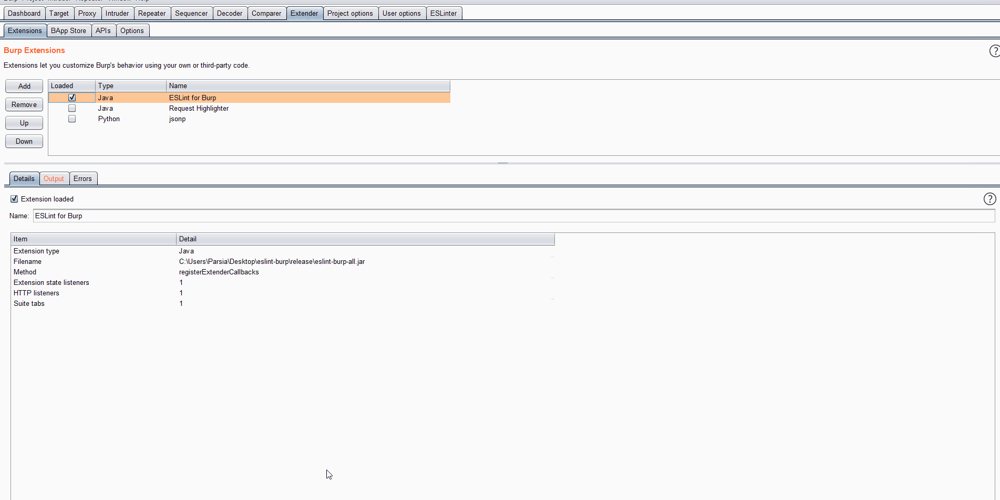

# Manual JavaScript Linting is a Bug  <!-- omit in toc -->
`ESLinter` is a Burp Suite extension that extracts JavaScript from responses and
lints them with [ESLint][eslint-org]. It does not interrupt your web application
testing flow.

[eslint-org]: https://eslint.org/

## JavaScript Analysis For All

1. Burp's JavaScript static and dynamic analysis is great but not customizable.
    1. You can write your own custom ESLint rules to analyze JavaScript.
2. Burp's JavaScript analysis is a Pro version feature.
    1. This is a free version feature.

## Quickstart

1. You need `git` and `npm` installed as global commands.
2. Clone the repository.
3. Run `gradlew install`
    1. Clones the `eslint-security` git submodule.
    2. Runs `npm install` in `eslint-security`.
4. Run `gradlew config -Ptarget=testproject`
    1. Creates a directory names `testproject` inside the `eslinter` directory.
    2. Creates `config.json` in `release` with a sane configuration.
5. Add the jar file to Burp.
6. Navigate to the `ESLinter` tab and click on the `Process` button.
7. Browse the target website normally with Burp as proxy.
8. Observe the extracted JavaScript being linted.
9. Double-click on any result to open a dialog box. Choose a path to save both
   the beautified JavaScript and lint results.
10. Look in the project directory to view all extracted and linted files.

## Table of Content <!-- omit in toc -->

- [JavaScript Analysis For All](#javascript-analysis-for-all)
- [Quickstart](#quickstart)
- [Detailed Configuration](#detailed-configuration)
- [Technical Details](#technical-details)
- [Tips and Tricks](#tips-and-tricks)
    - [Customize ESLint Rules](#customize-eslint-rules)
    - [Process Requests From Other Extensions](#process-requests-from-other-extensions)
- [Bugs](#bugs)
    - [Supported Platforms](#supported-platforms)
    - [The Connection to the Database Is Not Closed](#the-connection-to-the-database-is-not-closed)
    - [My Selected Row is Gone](#my-selected-row-is-gone)
- [FAQ](#faq)
    - [Why Doesn't the Extension Create Burp Issues?](#why-doesnt-the-extension-create-burp-issues)
    - [SHA-1 Is Broken](#sha-1-is-broken)
- [Triaging The results](#triaging-the-results)
- [Development](#development)
    - [Building the Extension](#building-the-extension)
    - [Development](#development-1)
    - [Debugging](#debugging)
- [Credits](#credits)
    - [Lewis Ardern](#lewis-ardern)
    - [ESLinting JavaScript](#eslinting-javascript)
    - [Automation](#automation)
    - [Similar Unreleased Extension](#similar-unreleased-extension)
    - [Source Code](#source-code)
- [Future Work and Feedback](#future-work-and-feedback)
- [License](#license)

## Detailed Configuration
At a minimum, you need to add the six keys discussed above to the configuration
file. For in-depth configuration, please see
[docs/configuration.md](docs/configuration.md).

## Technical Details
Please read [docs/technical-details.md](docs/technical-details.md) for the
innerworkings of the extension.

## Tips and Tricks

### Customize ESLint Rules
Start by modifying one of the ESLint config files in the
[eslint-security][eslint-security] repository. If you are adding a rule that
needs a new plugin/package you have to add it manually (usually via npm) to the
location of your `eslint` and `js-beautify` commands.

If you want to contribute your custom ESLint rules please feel free to create
pull requests in [eslint-security][eslint-security].

For more information on configuring ESLint and writing custom rules please see:

* https://eslint.org/docs/user-guide/configuring
* https://eslint.org/docs/developer-guide/working-with-rules

### Process Requests From Other Extensions

1. Add `extender` to the `process-tool-list`.
2. Move ESLinter to the bottom of your extension list in the Extender tab.
3. ESLinter should be able to see requests created by other extensions.

## Bugs
The extension is currently in Beta and has bugs. Make a Github issue if you
encounter a bug. Please use the Bug issue template and fill it as much as you
can. Be sure to remove any identifying information from the paths in the config
file.

### Supported Platforms
ESLinter was developed and testing on Windows and Burp 2.1. It should work on
most platforms.

### The Connection to the Database Is Not Closed
In other words, you cannot delete the database if you unload the extension.

Workaround:

* Close Burp and delete the file.

### My Selected Row is Gone
The table in the extension tab is updated every few seconds (controlled via the
`update-table-delay` key in the config file). This means your selected row
will be unselected when the table updates. This is not an issue.

This might look odd when double-clicking a row. The FileChooser dialog pops up
to select a path. When the table is updated, the selection is visually gone.
This is not an issue. The data in the row are retrieved when you double-click
and is not interrupted when the row is deselected after the table update.

## FAQ

### Why Doesn't the Extension Create Burp Issues?

1. This is not a Burp pro extension. Burp Issues work in the pro version.
2. Depending on the ESLint rules, this will create a lot of noise.

### SHA-1 Is Broken
Yes, but the extension uses SHA-1 to create a hash of JavaScript text. This hash
is an identifier to detect duplicates. Adversarial collisions are not important
here.

## Triaging The results
The extension uses the [codeframe][eslint-codeframe] format. This format has a
few lines of code before and after what was flagged by ESLint. The extension
keeps a copy of the original JavaScript file after it's beautified.

Double-clicking on any result row will open a FileChooser dialog to save both
the ESLint results and the original JavaScript.

[eslint-codeframe]: https://eslint.org/docs/user-guide/formatters/#codeframe

## Development

### Building the Extension

1. Run `gradlew bigjar`.
2. The jar file will be stored inside the `release` directory.

### Development

1. Fork the repository.
2. Create a new branch.
3. Modify the extension.
4. Run `gradlew bigjar` to build it. Then test it in Burp.
5. Create a pull request. Please mention what has been modified.

### Debugging
Set `"debug": true` in the config file to see debug messages. These messages are
useful when you are testing a single file in Burp Repeater.

See the following blog post to see how you can debug Java burp extensions in
[Visual Studio Code][vscode-website]. The instructions can be adapted to other
IDE/editors.

* https://parsiya.net/blog/2019-12-02-developing-and-debugging-java-burp-extensions-with-visual-studio-code/

[vscode-website]: https://code.visualstudio.com/

## Credits

### Lewis Ardern
For being the [Solid 5/7 JavaScript guy][lewis-twitter] he is.

See his presentation [Manual JavaScript Analysis is a Bug][lewis-slides].

[lewis-twitter]: https://twitter.com/lewisardern
[lewis-slides]: https://www.slideshare.net/LewisArdern/manual-javascript-anaylsis-is-a-bug-176308491

### ESLinting JavaScript
The original idea for the ESLinting JavaScript received in Burp was from the
following blog post by [Jacob Wilkin][jacob-wilkin-twitter]:

* https://medium.com/greenwolf-security/linting-for-bugs-vulnerabilities-49bc75a61c6

Summary:

1. Browse the target and perform manual testing as usual.
2. Extract JavaScript from Burp.
3. Clean them up a bit and remove minified standard libraries.
4. Run ESLint with some security rules on the remaining JavaScript.
5. Triage the results.
6. ???
7. Profit.

[jacob-wilkin-twitter]: https://twitter.com/jacob_wilkin

### Automation
My main drive for automation comes from reading the amazing article named
[Manual Work is a Bug][manual-work] by [Thomas Limoncelli][tom-twitter].
**READ IT**.

The article defines four levels of automation:

1. Document the steps.
    * Jacob's post above. 
2. Create automation equivalents.
    * At my day job, I create a prototype that linted JavaScript files after I
      extracted them from Burp manually.
3. Create automation.
    * We are here.
4. Self-service and autonomous systems.
    * Almost there in future work.
 
[manual-work]: https://queue.acm.org/detail.cfm?id=3197520
[tom-twitter]: https://twitter.com/yesthattom

### Similar Unreleased Extension
Searching for ["eslint burp" on Twitter][eslint-burp-twitter] returns a series
of tweets from 2015 by [David Rook][david-rook-twitter]. It appears that he was
working on a Burp extension that used ESLint to create issues. The extension was
never released.

[eslint-burp-twitter]: https://twitter.com/search?q=eslint%20burp&src=typed_query
[david-rook-twitter]: https://twitter.com/davidrook

### Source Code
This extension uses a few open source libraries. You can see them in the
`dependencies` section of the [build.gradle](build.gradle) file.

In addition, it uses code copied from Apache Commons libraries.

* [src/utils/StringUtils.java](src/utils/StringUtils.java) uses code from the
  Apache commons-lang.StringUtils.
* [src/utils/SystemUtils](src/utils/SystemUtils.java) is an almost exact copy of
  Apache Commons Lang SystemUtils.

## Future Work and Feedback
Please see the Github issues. If you have an idea, please make a Github issue
and use the `Feature request` template.

## License
Opensourced under "GNU General Public License v3.0". Please see
[LICENSE](LICENSE) for details.
